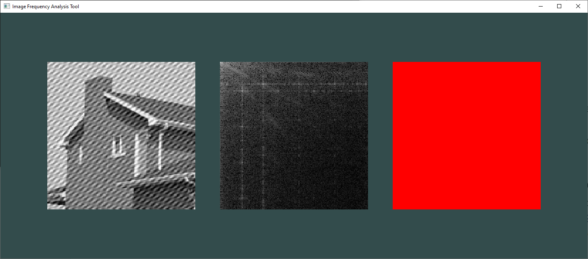

# ImageFrequencyAnalysis

A simple tool to perform frequency domain notch filters on images with [periodic noise](https://en.wikipedia.org/wiki/Image_noise#Periodic_noise).

## Usage

Load an image and use the cursor to draw notch masks on the canvas.

